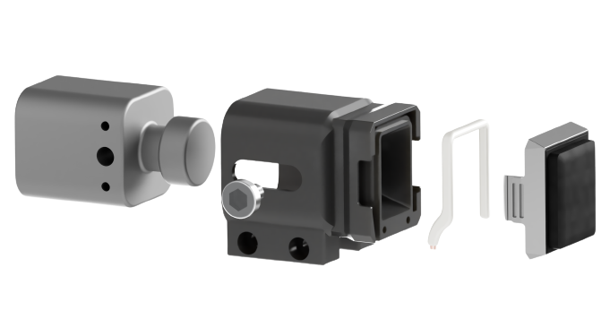

# evetac_design

<!-- PROJECT LOGO -->
<br />
<div align="center">
  <a href="https://github.com/nifunk/evetac_design">
    
  </a>

  <h3 align="center">Evetac: An Event-based Optical Tactile Sensor
for Robotic Manipulation</h3>
  <h5 align="center">Niklas Funk, Erik Helmut, Georgia Chalvatzaki, Roberto Calandra, Jan Peters</h5>

  <p align="center">
    We introduce a new event-based optical tactile sensor called Evetac. Its modular design attempts to maximize the re-use of existing components to facilitate reproducibility. You can simply 3D print the housing and assemble the sensor yourself. This repo contains the mechanical design files of the sensor and additional adapters. They are designed to be 3D printed so that you are able to produce them yourself and/or modify them to fit your needs. <br />
    <a href="https://sites.google.com/view/evetac"><strong>For more information about Evetac, visit the Project Page. »</strong></a> \
    <a href="https://youtu.be/24e9n3mCopw"><strong>Click here for a Video Tutorial on how to assemble Evetac. »</strong></a>
  </p>
</div>


<!-- TABLE OF CONTENTS -->
<details>
  <summary>Table of Contents</summary>
  <ol>
    <li>
      <a href="#sensor-overview">Sensor Overview</a>
    </li>
    <li>
      <a href="#alternative-evetac-versions">Alternative Evetac Versions</a>
    </li>
    <li>
      <a href="#customization-and-3d-printing">Customization and 3D Printing</a>
    </li>
    <li>
      <a href="#questions-and-contributing">Questions and Contributing</a>
    </li>
    <li>
      <a href="#citing">Citing</a>
    </li>
  </ol>
</details>


<!-- Sensor Overview -->
## Sensor Overview
The sensor mainly consists of off-the-shelf components, as well as a 3D printed case for facilitating manufacturing and reducing the entry barrier into the field of event-based tactile sensing. You can find a detailed overview of the sensors components in the following table:

| Component     |                     Specifications                    | References |
|---------------|-------------------------------------------------------|------------|
| Camera        | DVXplorer Mini from Inivation, 640 x 480px resolution | <a href="https://shop.inivation.com">Inivation</a>  |
| Housing       |               Custom Design, 3D printed               | <a href="/evetac_housing/evetac-housing.stl">Design File</a>       |
| Camera Screws |               1/4", thread length 6.3mm               | <a href="https://www.amazon.de/gp/product/B01AZ558WE/ref=ppx_yo_dt_b_asin_title_o01_s00?ie=UTF8&psc=1">Amazon</a> |
| LED stripe    |   LED COB band 4000K,  height 5mm, witdth 2.2mm, 12V  | <a href="https://www.amazon.de/gp/product/B09WHY4Q33/ref=ppx_yo_dt_b_asin_title_o00_s00?ie=UTF8&th=1">Amazon</a>     |
| Gel           |                GelSight Mini Marker Gel               | <a href="https://www.gelsight.com/product/tracking-marker-replacement-gel/">GelSight</a>   |

All the adaptors for the Franka Emika Panda robot arm, Robotis RH-P12-RN gripper, and OptiTrack accessories that were used in the experiments can be found in the respective folders: <a href="/adapters">adapters</a> and <a href="/optitrack">optitrack</a>.

<!-- Alternative Evetac Versions -->
## Alternative Evetac Versions
To improve sensor reproducibility, we aim to provide additional Evetac Designs <a href="/evetac_housing/alternative_designs/">here</a>.
* December 2023: Adding support for the newly released DVXplorer Micro event-based camera from Inivation. 

<!-- Customization and 3D Printing -->
## Customization and 3D Printing
In case you want to customize the provided 3D models and print them on a 3D printer, you will need to download the .STEP files, modify them according to your needs and prepare it for the printer using specialized software. Here are the general steps to follow:

1. Choose a 3D modeling software: There are many 3D modeling software options available, both free and paid. Some popular options are <a href="https://www.autodesk.de/products/fusion-360">Fusion 360</a> or <a href="https://www.freecad.org/index.php?lang=de">FreeCAD</a>.
2. Customize the 3D model: Using the 3D modeling software, open the .STEP file of the object you want to edit and modify it to fit your needs. You can of course also create a new 3D model from scratch.
3. Export the file: Once the 3D model is complete, you will need to export it in a format that can be read by a 3D printer. The most common file format for 3D printing is .STL (STereoLithography).
4. Slice the file: The .STL file needs to be "sliced" into thin layers that the 3D printer can print one at a time. This is done using slicing software (e.g. <a href="https://ultimaker.com/de/software/ultimaker-cura">Cura</a> for <a href="https://de.wikipedia.org/wiki/Fused_Deposition_Modeling">FDM</a> 3D printers like the Prusa MK series), which takes the 3D model and creates a set of instructions that the 3D printer can understand.
5. Transfer the file: Once the file is sliced, it can be transferred to the 3D printer either through a SD Card, USB cable or wirelessly, depending on the printer.
6. Start printing: Load the 3D printer with the material you want to use (such as PLA or ABS), and start the printing process. The printer will then print the object layer by layer until it is complete.

Keep in mind that the specific steps for creating a 3D file may vary depending on the software and printer you are using. It is important to refer to the manufacturer's instructions and guides to ensure you are creating a file that is compatible with your 3D printer.

<!-- Questions and Contributing -->
## Questions and Contributing
If you have any questions or need help with setting up the sensor, please create an <a href="https://github.com/nifunk/evetac_design/issues/new">issue</a>.

We also welcome contributions to this repository, including new 3D models or other improvements. If you would like to contribute, please <a href="https://github.com/nifunk/evetac_design/fork">fork</a> this repository and submit a <a href="https://github.com/nifunk/evetac_design/compare">pull request</a> with your changes, or reach out to niklas [at] robot-learning [dot] de.

<!-- Citing -->
## Citing
If you use this project in your research, please cite it.

```
@article{funk2023evetac,
      title={Evetac: An Event-based Optical Tactile Sensor for Robotic Manipulation}, 
      author={Niklas Funk and Erik Helmut and Georgia Chalvatzaki and Roberto Calandra and Jan Peters},
      journal={arXiv preprint arXiv:2312.01236},
      year={2023}
}
```
